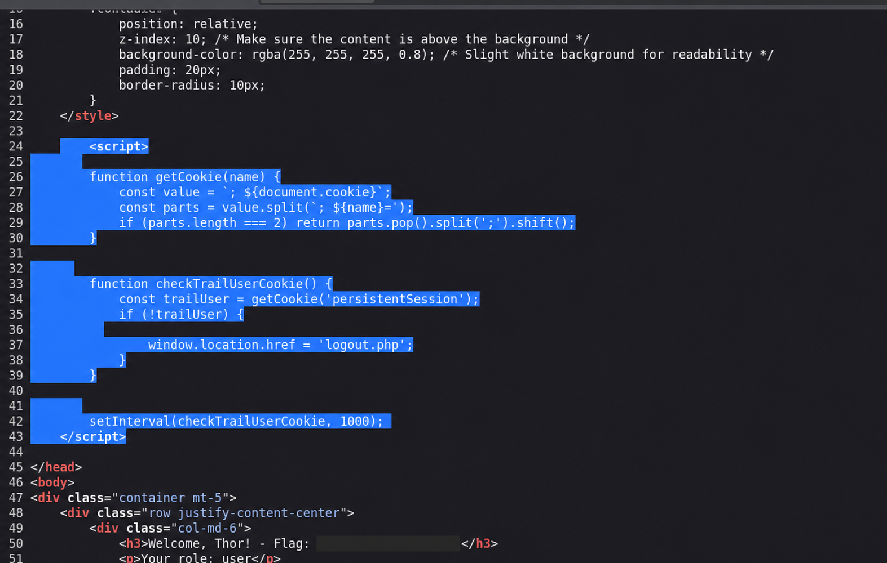

# Hammer - From password reset bypass to command execution

> **Takeaway:** Hammer showed me how two weaknesses that look separate - a weak password-reset rate limit and unsafe JWT key handling - can be chained into full command execution.

| Field | Details |
| --- | --- |
| Platform | TryHackMe |
| Category | Web security / Authentication / JWT |
| Difficulty | Intermediate |
| Environment | Authorized CTF lab |
| Completed | 2026-07-12 |
| Main skills | Web enumeration, rate-limit testing, session analysis, JWT abuse |

## Summary

The application used a four-digit password-reset code and based its rate limit on the `X-Forwarded-For` header. Because that header could be changed by the client, I was able to obtain a fresh attempt budget for each candidate code and take over a test account.

Once inside the dashboard, I found a downloadable HMAC key and a JWT whose `kid` field selected a local key file. I used the exposed key to sign a new token with the `admin` role. The application accepted it and enabled command execution through its administrative endpoint.

```text
Web enumeration -> Reset-code bypass -> Account access -> JWT forgery -> Command execution
```

## Scope

This write-up covers the **Hammer** room on TryHackMe, an intentionally vulnerable and authorized environment.

## How I approached the room

The room description mentioned an authentication bypass followed by RCE, so I expected the two stages to be connected. I started by mapping the exposed services and the application's authentication flow instead of immediately trying payloads.

```bash
rustscan -a $TARGET
nmap -sC -sV -p 22,1337 $TARGET
gobuster dir -u http://$TARGET:1337/ \
  -w /home/kali/Tools/dirbuster-wordlist/directory-list-2.3-medium.txt \
  -t 30 -x php,js,txt
```

The target exposed SSH on port 22 and an Apache/PHP application on port 1337. I briefly checked the login request for common SQL injection behaviour, but the results did not support that path, so I moved on rather than spending more time forcing the hypothesis.

The useful clue came from a developer comment in the page source:

```html
<!-- Dev Note: Directory naming convention must be hmr_DIRECTORY_NAME -->
```

Following that naming pattern led me to exposed logs. They contained references to `tester@hammer.thm` and showed that the account was recognized in one authentication context.


*Figure 1. The exposed log identified a valid test account.*

This changed my focus from the normal login form to the password-reset workflow.

## Password-reset bypass

The reset form accepted a four-digit recovery code valid for approximately three minutes. Incorrect attempts reduced a `Rate-Limit-Pending` response header, which suggested that the server was tracking an attempt budget.

My first test was misleading. I accidentally placed an `X-Forwarded-For` line in the POST body instead of the HTTP headers, so it became part of the timer parameter. The resulting error only proved that the timer value was invalid; it said nothing about the rate limit.

After noticing the malformed request, I repeated the test while changing only one element at a time:

1. I submitted an incorrect code with a fixed `X-Forwarded-For` value.
2. Repeating the same value reduced the remaining attempts.
3. Changing the header value restored the attempt budget.

That comparison confirmed that the application trusted a client-controlled forwarding header when identifying the source of password-reset attempts.

```http
POST /reset_password.php HTTP/1.1
Cookie: PHPSESSID=<session-cookie>
X-Forwarded-For: [different value for each attempt]
Content-Type: application/x-www-form-urlencoded

recovery_code=[0000-9999]&s=[current timer value]
```

I paired each candidate recovery code with a different forwarded address. This allowed the four-digit code space to be tested without exhausting the per-address limit. The valid code opened the password-change step, and the new credentials provided dashboard access.

### Why it worked

`X-Forwarded-For` should only be trusted when it is added or sanitized by a known reverse proxy. Here, the application accepted the value directly from the client. A four-digit code can only provide meaningful protection if rate limiting cannot be bypassed.

## Understanding the dashboard

After logging in, I first captured a normal request to understand which controls were actually enforced.

The dashboard sent JSON commands to `/execute_command.php` and included both a PHP session cookie and an HS256 JWT. Removing either the session or the bearer token caused the request to fail. Changing only the JWT role also failed signature verification, confirming that the server was checking the signature.

The page logged the browser out after a short period. Looking at the client-side code showed that it only checked whether a `persistentSession` cookie existed. Creating that cookie or replaying the captured request directly in Burp was enough to continue testing.



*Figure 2. The dashboard checked for the presence of a client-readable cookie before redirecting to logout.*

This behaviour was useful during testing, but it was not the main vulnerability. The more important detail was in the JWT header: its `kid` value pointed to a key file on the server.

## From JWT analysis to an admin token

The user-level command interface allowed `ls`, which revealed a file named `188ade1.key` in the web directory.


*Figure 3. The limited command interface exposed the name of a key file stored in the web directory.*

Requesting that file over HTTP returned HMAC key material. At this point the attack path became clear: if the server trusted the JWT's `kid` field to choose a local verification key, I could point it to a key whose contents I already knew and sign my own token.

Before doing that, I ran two small checks to confirm my understanding:

- changing the role without resigning the token produced a signature error;
- selecting an empty local file produced an error stating that key material could not be empty.

These responses supported the hypothesis that the server read the file selected by `kid` and used its contents during verification.

I created a new HS256 token with:

- `kid` set to `/var/www/html/188ade1.key`;
- the downloaded file content as the signing secret;
- the nested role changed from `user` to `admin`.


*Figure 4. JWT configuration used to validate the key-selection hypothesis.*

The application accepted the forged token. With the valid PHP session still present, the administrative command endpoint allowed the command required to retrieve the final challenge proof.


*Figure 5. Successful response from the command endpoint.*

No persistence, lateral movement or additional post-exploitation activity was needed.

## Findings

### 1. Password-reset rate-limit bypass

| Attribute | Assessment |
| --- | --- |
| Severity | High |
| Affected component | `/reset_password.php` |
| Preconditions | Knowledge of a valid account email |
| Impact | Account takeover |

The application tied password-reset attempts to an untrusted `X-Forwarded-For` value. Rotating that value provided a new attempt budget and made it possible to test the complete four-digit recovery-code space.

**Recommended fixes:**

- Trust forwarding headers only when they come from a configured reverse proxy.
- Rate-limit by account and reset transaction, not only by IP address.
- Use longer, cryptographically random, one-time reset tokens.
- Alert on many failed codes for one account, especially when forwarded addresses change rapidly.

### 2. Exposed JWT key and unsafe `kid` handling

| Attribute | Assessment |
| --- | --- |
| Severity | Critical |
| Affected components | JWT verification, exposed key file, command endpoint |
| Preconditions | Authenticated session and access to the exposed key |
| Impact | Forged admin token and command execution |

The JWT verifier allowed an attacker-controlled `kid` value to select local key material. Because an HMAC key was also downloadable from the web directory, I could sign a valid token containing the `admin` role. The command endpoint trusted that role and enabled privileged functionality.

**Recommended fixes:**

- Map a small allowlist of key IDs to server-controlled keys; never treat `kid` as a file path.
- Store signing keys outside the web root and rotate the exposed key.
- Enforce authorization using trusted server-side account state.
- Remove arbitrary command execution from the application or strictly isolate the allowed operations.
- Monitor unusual `kid` values, key-file downloads and privileged requests following a password reset.

## What I learned

The most useful part of this room was not the final payload. It was learning to separate a real result from a misleading one. My first forwarded-header test was malformed, and accepting it as evidence would have sent the investigation in the wrong direction. Repeating the test with one controlled change at a time made the vulnerability clear.

The JWT stage reinforced the same lesson. Error messages were useful, but I treated them as clues and validated each assumption before building the forged token. The final compromise came from chaining several individually understandable weaknesses rather than from one complicated exploit.

## Tools used

| Tool | Purpose |
| --- | --- |
| RustScan and Nmap | Port and service discovery |
| Gobuster / FFUF | Content discovery |
| Burp Suite | Request comparison, replay and reset-flow testing |
| sqlmap | Quick SQL injection triage; no finding |
| JWT Debugger | JWT inspection and signing in the lab |

## Author note

This write-up documents an authorized training environment and is intended for education and responsible security testing.
