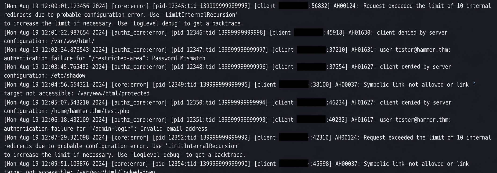
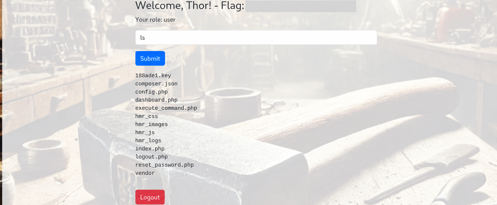
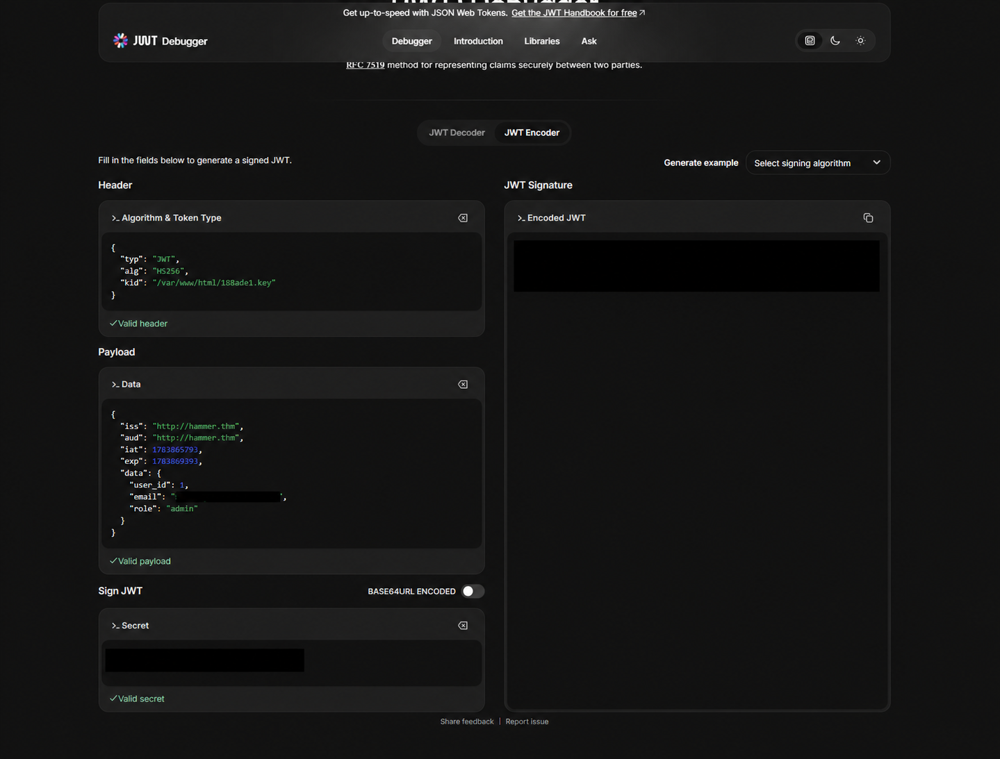
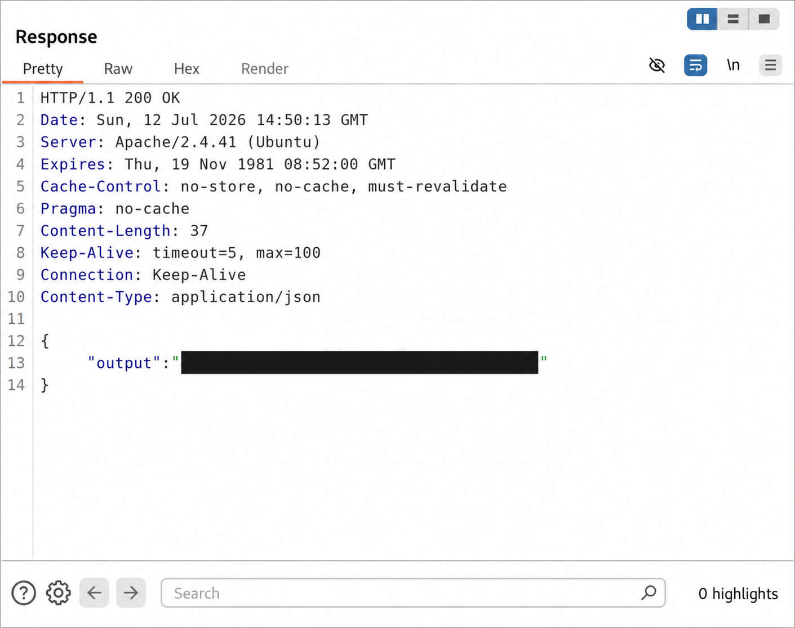

# Hammer - From password reset bypass to command execution

> **Takeaway:** Two weaknesses that looked separate - a bypassable password-reset limit and unsafe JWT key handling - could be chained into command execution.

| Platform | Difficulty | Focus | Outcome |
| --- | --- | --- | --- |
| TryHackMe | Intermediate | Authentication and JWT security | Account takeover and command execution |

## At a glance

I found a test account in exposed application logs, then discovered that the password-reset rate limit trusted the client-controlled `X-Forwarded-For` header. Rotating that value allowed me to test the four-digit recovery-code space and access the dashboard.

The authenticated application exposed an HMAC key and used the JWT `kid` field to select a local verification file. With the known key, I signed an `admin` token that the command endpoint accepted.

```text
Exposed logs -> Reset bypass -> Dashboard access -> Admin JWT -> Command execution
```

## Investigation

### 1. Finding the useful entry point

Initial service and content discovery identified an Apache/PHP application on port 1337. The most useful clue was a developer comment in the page source:

```html
<!-- Dev Note: Directory naming convention must be hmr_DIRECTORY_NAME -->
```

Following that naming convention led me to exposed logs containing `tester@hammer.thm`. This gave me a valid account to investigate and shifted my attention from the normal login page to the password-reset flow.

<details>
<summary>Evidence: exposed account in application logs</summary>



</details>

### 2. Validating the reset bypass

The reset form used a four-digit recovery code and returned the remaining attempt count in `Rate-Limit-Pending`.

My first test was invalid because I accidentally placed `X-Forwarded-For` in the POST body instead of the HTTP headers. The response only proved that I had broken the timer parameter, so I discarded that result and repeated the test while changing one value at a time.

Reusing the same forwarded address reduced the remaining attempts. Supplying a different address restored the full budget. This confirmed that the application trusted a header controlled by the client. Pairing each candidate code with a different value made it possible to test the code space, reset the password and reach the dashboard.

The weakness existed because `X-Forwarded-For` was accepted without a trusted proxy boundary and the rate limit was not also tied to the account or reset transaction.

### 3. From dashboard access to an admin token

I first captured a normal dashboard request to understand the controls. The command endpoint required both the PHP session and a signed HS256 JWT; changing the role without signing the token correctly failed verification.

The user-level command interface allowed `ls`, which revealed `188ade1.key` inside the web directory. The file was downloadable and contained HMAC key material. The JWT header also used `kid` as a local file path, so I tested whether the server used that path to load its verification key. The application's responses supported that hypothesis.

I signed a new token with the exposed key, set `kid` to its server path and changed the role to `admin`. The application accepted the token and enabled the administrative command functionality used to retrieve the final proof.

<details>
<summary>Evidence: key discovery and forged token</summary>





</details>

<details>
<summary>Evidence: command execution</summary>



</details>

No persistence, lateral movement or additional post-exploitation activity was needed.

## Findings and fixes

| Severity | Finding and impact | Recommended fix |
| --- | --- | --- |
| High | **Password-reset rate-limit bypass.** Rotating an untrusted `X-Forwarded-For` value allowed the complete recovery-code space to be tested, leading to account takeover. | Accept forwarding headers only from trusted proxies. Rate-limit by account and reset transaction, and use long, random, one-time reset tokens. |
| Critical | **Exposed JWT key and unsafe `kid` handling.** A downloadable HMAC key and attacker-selected key path allowed an `admin` token to be forged, leading to command execution. | Keep keys outside the web root, rotate exposed material, map allowlisted key IDs to server-controlled keys and enforce authorization from trusted server-side state. |

## What I learned

The key lesson was to separate an interesting response from valid evidence. Correcting my malformed forwarded-header test and changing one variable at a time made the first vulnerability clear. The final result then came from validating and chaining several small weaknesses rather than relying on one complex exploit.

**Tools:** RustScan, Nmap, Gobuster/FFUF, Burp Suite and a JWT debugger.

This write-up documents an authorized TryHackMe environment.
