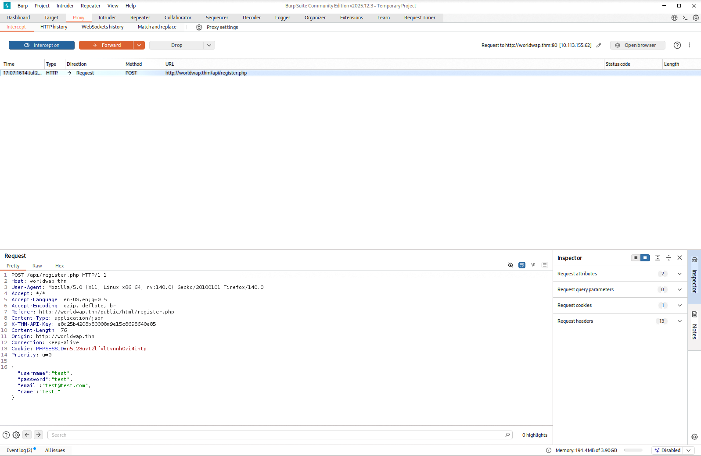
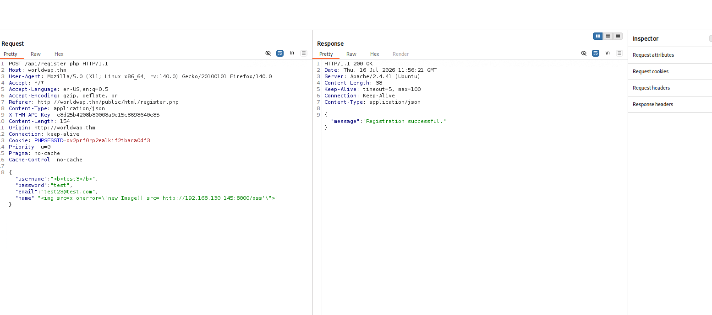
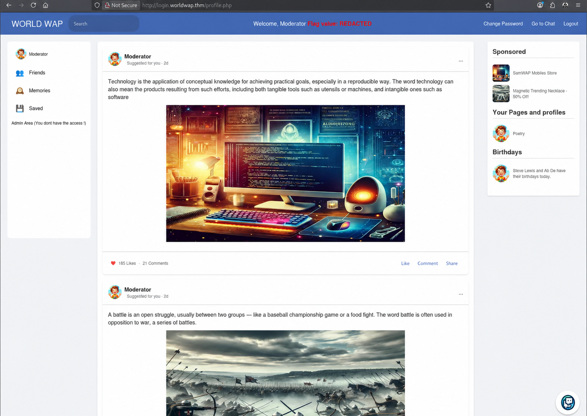
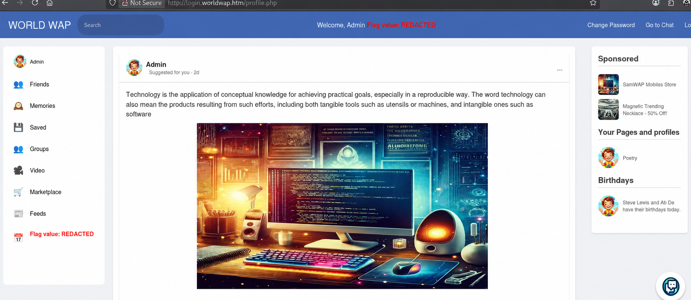

# What's Your Name? - Stored XSS to administrator account takeover

> Treating user-controlled content as HTML turned a pending registration into a moderator-session hijack and then into full administrator access.

| Platform | Difficulty | Focus | Outcome |
| --- | --- | --- | --- |
| TryHackMe | Medium | Client-side exploitation | Moderator session hijacking and administrator account takeover |

## At a glance

I began with service discovery and found SSH plus two Apache HTTP services. The public WorldWAP registration flow used a separate login virtual host, `login.worldwap.thm`, and new accounts were deliberately held for moderator verification. That workflow made the registration data a high-value target: the `name` field was later rendered in a privileged browser context without output encoding.

I used that stored XSS to recover the moderator session. The authenticated moderator area exposed a chat whose messages were also rendered as HTML. Its Admin Bot opened the chat page, so a second stored-XSS payload made a same-origin password-change request in the bot's session. I could then authenticate as Administrator normally.

```text
Unescaped registration name -> Moderator XSS -> Session hijack -> Chat XSS -> CSRF password reset -> Administrator access
```

## Investigation

### 1. Mapping the application flow

My initial scan identified SSH on port 22 and Apache on ports 80 and 8081. The public site exposed pre-registration, while its client-side messages directed successful registrants to `login.worldwap.thm`. I compared the two flows rather than assuming the first login page was authoritative.

The registration request sent JSON to `/api/register.php`, including `username`, `password`, `email`, and `name`. Although registration returned success, the same credentials received **User not verified** at login. This established moderator approval as the meaningful boundary.

<details>
<summary>Evidence: registration API request</summary>



</details>

### 2. Turning pending registration into a moderator session

The registration JavaScript passed `name` to the API without client-side validation. I used harmless HTML to establish that markup was accepted, then submitted a controlled callback payload. When the request was reviewed, my listener received a target request, proving execution in the moderator's browser.

<details>
<summary>Evidence: stored XSS payload accepted</summary>



</details>

The callback was extended to return the browser session identifier. `PHPSESSID` lacked `HttpOnly`, so script in the moderator context could read it. After URL-decoding the lab-only value, I accessed `login.worldwap.thm/profile.php` as Moderator, confirming a real session compromise.

<details>
<summary>Evidence: moderator session hijacking</summary>



</details>

### 3. Identifying the second XSS sink

As Moderator, I inspected the chat application and its live message polling endpoint. Omitting the optional time parameter returned the available chat history, which helped me understand the polling behaviour but did not by itself indicate a security issue.

New messages were added with `messageDiv.innerHTML = msg.message`, and a harmless HTML message rendered as markup. The page also displayed an online Admin Bot and a control to move it to `chat.php`. After I posted a callback payload and used that control, the target requested my listener again. The Admin Bot therefore rendered attacker-controlled content.

### 4. Using the bot context for password reset

I captured the ordinary password-change request first. It was a same-origin `POST /change_password.php` with form-encoded `new_password` data and no anti-CSRF token. A second chat payload issued that request from the Admin Bot's browser context, automatically including its session.

After triggering the bot to open the chat, the password change succeeded. I authenticated with the lab-only replacement password and obtained the Administrator profile. No flag, session value, API key, or credential is recorded here.

<details>
<summary>Evidence: administrator account takeover</summary>



</details>

## Findings

| Severity | Finding and impact |
| --- | --- |
| High | **Stored XSS in registration `name`.** Moderator review rendered untrusted registration content as HTML, allowing arbitrary JavaScript and theft of the moderator session. |
| High | **Stored XSS in chat chained with unprotected password change.** Chat messages were inserted through `innerHTML`; the Admin Bot rendered them, and `/change_password.php` accepted a state-changing request without a CSRF token. This enabled an attacker to reset the administrator password. |

## What I learned

This room reinforced that client-side findings need to be followed through the full trust boundary. I moved from noticing a field accepted HTML to proving which privileged browser rendered it, then separated a session-theft issue from the later action-forcing issue. Capturing normal requests before reproducing them through JavaScript kept the exploit chain precise and avoided guessing endpoint behaviour.

**Tools:** Nmap, Gobuster, Burp Suite, browser developer tools, and a local HTTP listener.

This work was performed exclusively in the authorized TryHackMe training environment.
